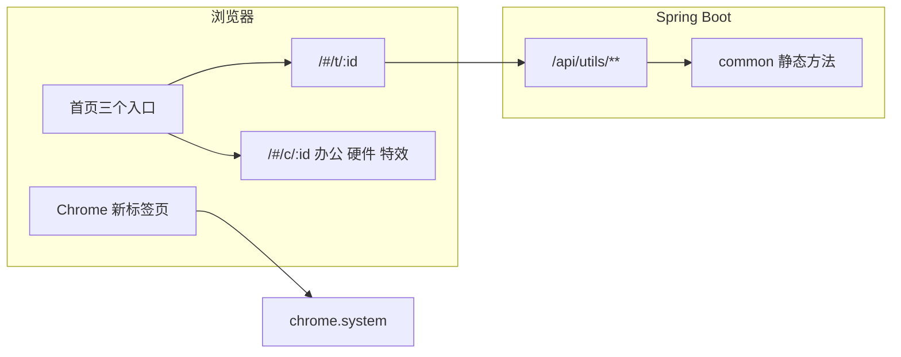

# 技术方案

本文说明本仓库怎么分层、接口怎么约定、控制台和安装包怎么跑。类清单在 [README](../README.md) 的能力一览，这里不重复罗列。

当前发行版本：**1.3.0**。

## 1. 目标

做成一套只依赖 JDK 与 Spring Boot 的通用工具库，并带一个能直接打开的控制台：

- Java 侧按领域提供静态工具方法，业务工程可以直接引用。
- 同一套方法通过 `/api/utils/**` 暴露成演示接口。
- 浏览器里再放一批不上传数据的本地工具、日常办公和硬件检测。
- 打成服务器 JAR，以及 Windows / Linux / macOS 可直接打开的安装包。
- Chrome 扩展用 `chrome.system` 在新标签页展示整机配置和占用。

## 2. 非目标

这些能力需要额外依赖或系统权限，当前明确不做：

| 不做 | 原因 |
| --- | --- |
| Excel、邮件、二维码、Redis、OSS | 会引入 JDK / Spring 以外的依赖 |
| DAO、Service 空壳 | 这是工具库，演示接口直接调 common 的静态方法 |
| 把工具类再摊回单一 `util` 包 | 已按领域分包，路径保持稳定 |
| 改掉 `/api/utils/**` | 控制台和已有调用都绑在这条前缀上 |
| 前端引入 vue-i18n | 文案表放在 `frontend/src/i18n/messages.js` |
| 翻译每一个工具标题 | 界面壳（导航、按钮、提示）做中 / 英 / 日 / 德；工具名保持现有中文 |
| 用普通网页读取任务管理器 | 浏览器没有整机 CPU / 内存接口，整机数据只走 Chrome 扩展 |
| 把硬件检测做成「表单 + JSON」 | 屏幕、键鼠、摄像头、麦克风必须是可交互页面 |
| jpackage 交叉编译 | exe 只能在 Windows 打，`.app` 只能在对应芯片的 macOS 打 |

## 3. 总体结构

```text
浏览器
  ├─ Vue 控制台（hash 路由，构建进 classpath:/static）
  │    ├─ /#/t/:id   调后端 /api/utils/**
  │    └─ /#/c/:id   以及办公 / 硬件 / 特效：只在浏览器里算
  └─ Chrome 扩展（新标签页，chrome.system.*）

Spring Boot
  ├─ web.controller   演示接口，无业务层
  ├─ web.advice       异常收成 Result
  ├─ web.filter       X-Trace-Id
  └─ common.*         可复用静态方法，除 net.ServletUtil 外不依赖 Servlet
```



仓库是单模块 Maven 工程。前端在 `frontend/`，扩展在 `extension/`，打包脚本在 `scripts/`。

## 4. 后端

根包 `com.mengzhihua.utils`。分层对齐《阿里巴巴 Java 开发手册》：Web 与通用层分开，通用层再按领域分包。

| 包 | 职责 |
| --- | --- |
| `common.api` | `Result`、`PageResult`、`ResultCode` |
| `common.exception` | `BizException`，由全局异常处理转成 `Result` |
| `common.lang` / `text` / `codec` / `crypto` | 字符串、脱敏、编码、加解密、哈希、JWT |
| `common.id` / `time` / `io` / `net` | ID、日期、文件、IP / URL / HTTP |
| `common.json` | Jackson 3 `JsonMapper`（`tools.jackson`） |
| `common.validate` / `math` / `concurrent` | 证件与校验、金额、重试 / 限流 / 本地缓存 |
| `common.extra` / `i18n` / `spring` / `bean` | 树、地理、链路号、Locale、Spring 上下文、反射 |
| `web.controller` | `@RequestMapping("/api/utils")` 的演示接口 |
| `web.advice` | `GlobalExceptionHandler` |
| `web.filter` | `TraceIdFilter` |
| `config` | OpenAPI、CORS、国际化、雪花参数、桌面启动 |

工具类是 `final` 类加私有构造和静态方法。演示 Controller 只做参数校验和调用，不再套一层 Service。

配置在 `application.yml`：

- 服务端口 `8080`，时区 `Asia/Shanghai`
- 国际化资源包 `i18n/messages`，默认语言英文，不回退到系统语言
- Actuator 只暴露 `health`、`info`，健康检查不展开详情
- 雪花 `utils.snowflake.worker-id` / `datacenter-id`，范围 0–31

`common.json.JsonUtil` 使用 Jackson 3。HTTP 层的 `Result` 仍用 `com.fasterxml.jackson.annotation` 标注，由 Spring MVC 写出 JSON。

## 5. 接口约定

成功响应：

```json
{ "code": 200, "message": "success", "data": {}, "timestamp": 0 }
```

`code` 为 **200** 表示成功，不是 0。前端 `callTool` 同时要求 HTTP 成功且 `payload.code === 200`。

| `ResultCode` | 含义 |
| --- | --- |
| 200 | 成功 |
| 400 | 参数或方法不对 |
| 401 / 403 | 预留 |
| 404 | 资源不存在 |
| 422 | 校验失败 |
| 500 | 业务失败或未分类异常 |

其它约定：

- 全部演示接口挂在 `/api/utils/**`。同一个 HTTP 方法加路径只能出现一次，重复的 `@GetMapping` 会让容器起不来。
- 每个请求读写 `X-Trace-Id`。没有传入时由 `TraceIdUtil` 生成，并在响应头回写。
- `/api/**` 允许跨域，方法含 GET / POST / PUT / DELETE / OPTIONS。
- 语言按这个顺序解析：查询参数 `lang`、请求头 `X-Locale`、`Accept-Language`。后端支持的 Locale 见 `LocaleUtil.SUPPORTED`（en、zh、ja、de、fr、ko、es 等）。缺参、404、500 的文案走 `MessageSource`。
- OpenAPI 在 `/v3/api-docs`，Swagger UI 在 `/swagger-ui.html`。
- 分页数据放在 `Result.data` 里，结构是 `PageResult`：`page`、`size`、`total`、`records`。

已经占用、不能再挂第二条的路径：

| 路径 | 含义 |
| --- | --- |
| `/api/utils/age` | 年龄，`AgeUtil` |
| `/api/utils/http-age` | HTTP `Age` 头 |
| `/api/utils/vat` | `VatUtil`（DE / FR / NL） |
| `/api/utils/iban` | IBAN |
| `/api/utils/ico` | 捷克 / 斯洛伐克 IČO，不要再拆一条斯洛伐克专用路径 |
| `/api/utils/nif` | 西班牙 NIF / NIE |

斯洛伐克出生号没有单独接口。

## 6. 前端控制台

Vue 3 + Vue Router 4 + Vite 7。生产构建写到 `src/main/resources/static/`（`emptyOutDir: true`），由 Spring Boot 当作欢迎页。开发时 Vite 在 `5173`，把 `/api` 和 `/actuator` 代理到 `8080`。路由是 hash，避免安装包和静态托管再配 history fallback。

| 路由 | 页面 | 数据从哪来 |
| --- | --- | --- |
| `/#/` | 首页 | 三个入口 + 搜索；快捷按钮调后端 |
| `/#/office` | 日常办公 | 浏览器本地 |
| `/#/hw`、`/#/hw/:id` | 硬件检测台和单项 | 浏览器 API，每个 id 一块独立面板 |
| `/#/fx` | 特效实验室 | 纯展示 |
| `/#/t/:id` | Java 工具页 | `frontend/src/tools.js` 描述 method / path / 字段，`callTool` 发请求 |
| `/#/c/:id` | 本地工具页 | `frontend/src/clientTools.js`，不上传 |

首页在搜索框为空时只显示三张入口卡：日常办公、硬件检测、特效实验室。输入关键词后，办公、硬件、本地工具和 Java 工具的匹配结果紧挨搜索框出现。

左侧菜单：

- 一级是「日常办公」「硬件检测」「特效实验室」「前端工具」「Java 工具」。后两组默认收起。
- 二级是分组，三级才是具体工具。
- 进入某个工具时，自动展开它所在的分组，并把当前项滚进侧栏可视区域。
- 「搜索菜单」不展开整棵树，最多列 12 条，每条带分组名，其余显示「还有 N 项」。

`tools.js` 和 `clientTools.js` 里的 `id` 必须唯一。同名 id 后写的那条在界面上会被盖住。

界面文案在 `messages.js`，自写 `useI18n`，语言只有 `zh` / `en` / `ja` / `de`。切换语言时，后续请求带上对应的 `Accept-Language`。工具标题不进这张表。

办公计算（个税、房贷、发票）在浏览器里做一份，Java 里也有 `PitUtil`、`MortgageUtil`、`InvoiceVatUtil`，HTTP 分别为 `/api/utils/pit`、`/mortgage`、`/invoice-vat`。两边算法各自有测试，改一边时要核对另一边的样例是否还成立。

## 7. 硬件检测与 Chrome 扩展

硬件 id：`system`、`resources`、`screen`、`keyboard`、`mouse`、`pointer`、`click`、`gamepad`、`audio`、`camera`、`mic`。对应 `frontend/src/views/hw/*`。单项页返回检测台，检测台返回概览。

网页能读到的只有 UA-CH、`navigator`、WebGL/WebGPU、`performance.memory`、`PressureObserver`、Storage 配额、电池和媒体设备。整机 CPU 占用、物理内存、磁盘和显示器布局来自扩展：

- Manifest V3，`chrome_url_overrides.newtab`
- 权限：`system.cpu`、`system.memory`、`system.storage`、`system.display`
- CPU 占用：`1 - idleΔ / totalΔ`，在 `extension/lib/collect.js` 的 `cpuPercents`
- 文案：`_locales/zh_CN`、`en`、`ja`、`de`
- 没有 `chrome.system` 时，新标签页降级成网页能读到的核数、`deviceMemory`、视口和 GPU

扩展版本写在 `extension/manifest.json`，不跟 JAR 的 `pom.xml` 版本绑在一起。

## 8. 运行形态

| 形态 | 怎么启动 | 监听 | 打开的页面 |
| --- | --- | --- | --- |
| 服务器 | `java -jar utils-1.3.0.jar` | `0.0.0.0:8080` | `/#/` |
| 桌面 | `--desktop`，或 `utils.desktop=true`，或环境变量 `UTILS_DESKTOP=true` | `127.0.0.1:18765`（可用 `UTILS_PORT` 改） | `/#/office` |
| 原生包 | 双击 exe / `Utils.app` / 菜单里的 Utils / `./Utils` | 与桌面模式相同 | `/#/office` |

桌面模式由 `UtilsApplication` 追加 `desktop` profile，配置在 `application-desktop.yml`。就绪后 `DesktopLauncher` 用系统浏览器打开办公工作台。

原生包用 JDK 自带的 `jpackage`，脚本是 `scripts/package-native.sh` 和 `scripts/stage-native.py`。

| 平台 | jpackage 类型 | 发布文件 |
| --- | --- | --- |
| Windows x64 | `exe`（WiX 3.14，安装范围是当前用户） | `utils-<version>-windows-x64.exe` |
| Linux x64 | 先 `app-image` 再打 `deb` | `utils-<version>-linux-x64.deb`，以及带 `./Utils` 启动脚本的 `tar.gz` |
| macOS arm64 | `app-image` | `utils-<version>-macos-arm64.app.zip` 和同名 `.dmg` |
| macOS x64 | `app-image` | `utils-<version>-macos-x64.app.zip` 和同名 `.dmg` |

CI 上的 WiX 不走 Chocolatey，而是下载 `wix314-binaries.zip`，把 `candle.exe` 放进 `PATH`。Linux 打包机需要 `fakeroot` 和 `binutils`。

## 9. 自动发行

工作流：`.github/workflows/release.yml`。触发条件是推到 `main`、打 `v*` 标签，或手动运行。

1. `test`：`npm ci && npm run build`，再 `./mvnw test`。
2. `version`：`scripts/next-version.sh auto`。`pom.xml` 的工程版本比最新 `v*` 标签新，就用 pom；否则在最新标签上补丁 +1。提交说明里含 `[skip release]` 则跳过。标签或 Release 已经存在也跳过。
3. `jar`：`scripts/package.sh` 打 JAR，并用 `scripts/smoke.sh` 打健康检查。
4. `native`：四台机器并行。`fail-fast` 为 false，但发布步骤依赖全部 native 作业成功。
5. `publish`：打上 `v<version>` 标签并上传 JAR、sha256、`start.sh`、`start.bat`、`README.txt` 和四个平台的原生包。

并发组是 `release`，`cancel-in-progress` 为 false，所以上一版还在打包时，下一版会排队。

不要把 **v1.1.0** 当安装包用：那一版附件是打散的运行时文件。可用的安装包从 **v1.1.1** 起。不要重打已经存在的 `v1.0.0` 标签。

只改文档、不想发新版本时，提交说明写上 `[skip release]`。

## 10. 如何加一个工具

后端演示：

1. 在对应的 `common.*` 里加静态方法，用公开向量写 JUnit。
2. 在现有的 `*DemoController` 上加一个 `/api/utils` 下的唯一路径，返回 `Result.ok(...)`。参数不合法时抛 `BizException` 或使用 Bean Validation。
3. 在 `frontend/src/tools.js` 增加一条，`id` 不与已有条目重复，`path` 与注解一致。
4. `cd frontend && npm run build`，把新的静态资源提交进 `src/main/resources/static/`。

只在浏览器里算的工具：

1. 算法放在 `frontend/src/lib/clientUtils.js`（或硬件面板组件）。
2. 在 `clientTools.js` 登记，办公工具还要放进 `officeCategories`。
3. 硬件检测新增 id 时，要加独立面板并在 `HardwareTestView` 里挂上，不要退化成 JSON 表单。

改完跑 `./mvnw test`。前端构建已经进 CI，合并到 `main` 且没有 `[skip release]` 时会发新版本。

## 11. 测试

| 范围 | 命令 | 覆盖什么 |
| --- | --- | --- |
| Java | `./mvnw test` | 工具向量、演示接口、上下文能启动 |
| 前端生产包 | `cd frontend && npm run build` | 控制台能打进 `static/` |
| 发行冒烟 | `scripts/smoke.sh` | JAR 起来后 `/actuator/health` 为 UP |
| 原生包整理 | `scripts/test_stage_native.py` | exe / deb / 便携 tar / macOS app.zip 的文件名和启动脚本 |

证件、CRC、税号以各测试类里的公开向量为准。改算法时先改测试，再改实现。
